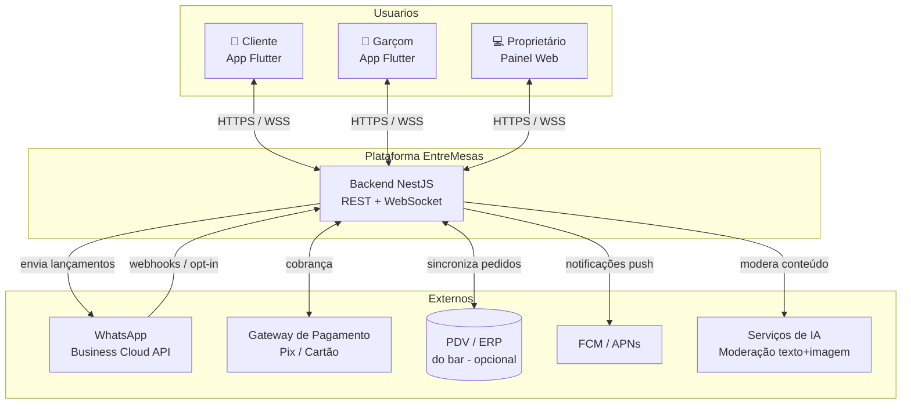
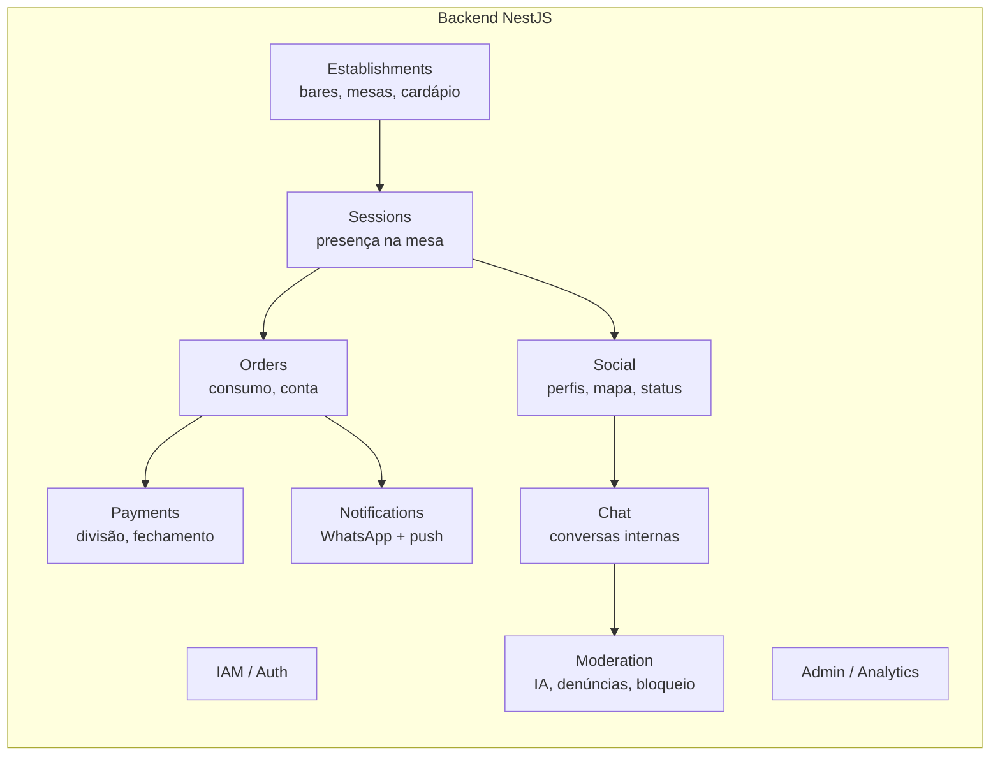
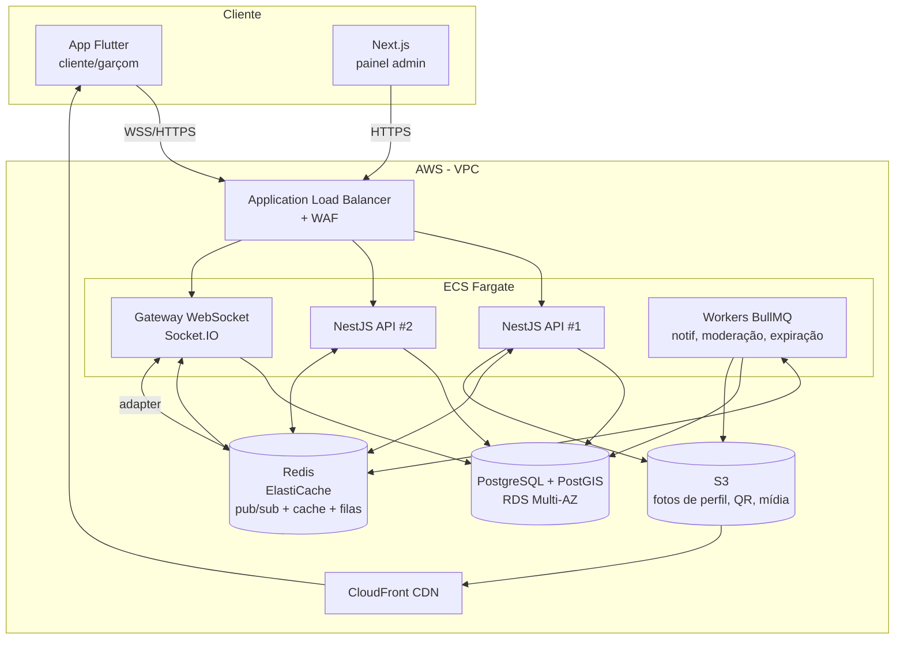
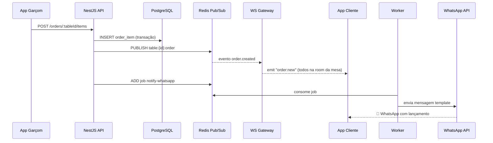

# 02 — Arquitetura do Sistema

← [Voltar ao índice](../README.md)

---

## 2.1 Visão Geral (C4 — Nível 1: Contexto)

---

## 2.2 Decisão de Arquitetura: Monólito Modular → Microsserviços

> **Decisão:** começar com um **monólito modular** no NestJS, com fronteiras de domínio bem
> definidas (módulos), pronto para extrair serviços conforme a escala exigir.

**Justificativa (ADR-001):** no MVP e nas primeiras centenas de bares, um monólito modular
entrega velocidade de desenvolvimento, transações simples e menor custo operacional. As
fronteiras de domínio já desenhadas permitem extrair `social`, `notifications` e `moderation`
como serviços independentes quando o volume justificar (ver gatilhos em §2.9).

### Módulos de domínio (bounded contexts)

---

## 2.3 Arquitetura de Componentes (C4 — Nível 2)

### Responsabilidades por componente

| Componente | Responsabilidade |
|---|---|
| **API (NestJS)** | REST: auth, cardápio, pedidos, perfis, relatórios. Regras de negócio. |
| **Gateway WebSocket** | Tempo real: lançamentos, presença, chat, mapa. Socket.IO + Redis adapter para escala horizontal. |
| **Workers (BullMQ)** | Jobs assíncronos: envio WhatsApp, moderação de IA, expiração de sessão/perfil, geração de relatórios. |
| **PostgreSQL + PostGIS** | Verdade transacional. PostGIS para geofencing do estabelecimento. |
| **Redis** | Presença efêmera (TTL), pub/sub entre instâncias, cache de mapa, rate limiting, filas. |
| **S3 + CloudFront** | Mídia (fotos de perfil, imagens de chat, QR codes) com CDN. |

---

## 2.4 Stack Tecnológica — Justificativas

### Frontend mobile: **Flutter** (sobre React Native)
- **Único codebase** iOS/Android com performance próxima de nativo.
- UI customizada e fluida — essencial para o **mapa animado de mesas** e transições do social.
- `flutter_map`/`google_maps_flutter` + canvas custom para o layout do salão.
- Hot reload acelera a iteração de UX.

### Backend: **NestJS** (sobre Express puro)
- Arquitetura modular opinativa (módulos = bounded contexts).
- **WebSocket Gateways** de primeira classe (`@WebSocketGateway`).
- Injeção de dependência, guards, interceptors, pipes — segurança e validação consistentes.
- TypeScript fim-a-fim (compartilha tipos/DTOs com Flutter via OpenAPI/codegen quando útil).

### Banco: **PostgreSQL + PostGIS**
- ACID para conta/consumo (onde erro = dinheiro e confiança).
- **PostGIS** para verificar presença (geofence) e ordenar mesas por proximidade.
- JSONB para campos flexíveis (preferências, metadados de moderação).

### Tempo real: **Socket.IO + Redis adapter**
- Reconexão automática, *rooms* (uma room por mesa, por estabelecimento, por conversa).
- Redis adapter permite **múltiplas instâncias** do gateway (escala horizontal).
- Fallback de transporte para redes instáveis de bar.

### Mensageria: **BullMQ (Redis)**
- Filas confiáveis para WhatsApp (retry/backoff), moderação e jobs agendados (expiração).

---

## 2.5 Arquitetura de Tempo Real

**Estratégia de "rooms" (Socket.IO):**
- `table:{tableId}` — todos os clientes presentes na mesa (consumo + presença).
- `establishment:{id}:social` — mapa social do bar (presença/status agregados).
- `conversation:{id}` — chat 1:1.
- `establishment:{id}:admin` — dashboard em tempo real do proprietário.

**Presença efêmera (Redis):**
- Chave `presence:{sessionId}` com **TTL renovado por heartbeat** (a cada 30 s).
- Expirou o TTL → worker dispara `session.expired` → remove do mapa, encerra perfil social.

---

## 2.6 Verificação de Presença Real (anti-fraude)

Combinação de sinais (defesa em profundidade):

1. **QR dinâmico** — o QR da mesa codifica um token que **rotaciona** (TOTP do
   estabelecimento), evitando que alguém escaneie uma foto do QR de casa.
2. **Geofence (PostGIS)** — o app envia localização no opt-in; precisa estar dentro do
   polígono do estabelecimento (raio + tolerância de GPS indoor).
3. **Heartbeat** — a sessão exige presença contínua (WebSocket + heartbeat).
4. **Validação opcional pelo garçom** — em casas mais rígidas, o garçom confirma a mesa.

> Detalhes e *threat model* em [09 — Segurança e Privacidade](./09-seguranca-privacidade.md).

---

## 2.7 Modelo de Sessões e Identidade

| Tipo de identidade | Persistência | Uso |
|---|---|---|
| **Conta do dispositivo** (anônima) | Persistente (device id + refresh token) | Lembrar preferências, histórico de consumo, banimentos |
| **Sessão de mesa** | Efêmera (dura a visita) | Vincula device ↔ mesa ↔ estabelecimento |
| **Perfil social** | Efêmero (expira ao sair) | Visível no mapa só durante a presença |
| **Staff (garçom/admin)** | Persistente, com papel (RBAC) | Operação e gestão |

**JWT:** `access_token` (15 min) + `refresh_token` (rotativo). Claims incluem `deviceId`,
`role`, e — quando em mesa — `sessionId` e `establishmentId`. Revogação via blocklist em Redis.

---

## 2.8 Integração com PDV (opcional, mas estratégica)

Dois modos de operação:

1. **EntreMesas como comanda** — o garçom lança direto no app (bares sem PDV ou que querem
   trocar). Fonte da verdade = EntreMesas.
2. **EntreMesas como camada de transparência** — integra via API/webhook ao PDV existente
   (ex.: Colibri, Linx, Goomer, Saipos, Consumer). Fonte da verdade = PDV; espelhamos
   lançamentos e devolvemos chamadas/fechamento.

> Adaptadores por PDV ficam isolados no módulo `establishments/integrations` (padrão
> *Anti-Corruption Layer*), evitando acoplar o domínio a um fornecedor.

---

## 2.9 Escalabilidade e Disponibilidade

| Aspecto | Estratégia |
|---|---|
| **API stateless** | Escala horizontal em ECS Fargate (autoscaling por CPU/conexões) |
| **WebSocket** | Redis adapter; sticky sessions no ALB; escala por nº de conexões |
| **Banco** | RDS Multi-AZ; réplicas de leitura para relatórios; particionamento de `order_items` e `messages` por data |
| **Picos** (sex/sáb à noite) | Autoscaling agendado + reativo; filas absorvem rajadas de notificação |
| **Cache** | Cardápio, layout de mesas e mapa social em Redis (TTL curto) |
| **Multi-tenant** | Isolamento por `establishment_id` em todas as tabelas + RLS opcional |

**Gatilhos para extrair microsserviços:**
- `notifications` → quando o volume de WhatsApp/push justificar isolamento e escala própria.
- `social` + `chat` → quando o número de conexões simultâneas dominar a carga.
- `moderation` → quando o custo/latência de IA exigir pipeline dedicado.

---

## 2.10 Observabilidade e Confiabilidade

- **Logs estruturados** (JSON) com `correlationId` por requisição/evento.
- **Tracing distribuído** (OpenTelemetry) cobrindo API → fila → worker → WhatsApp.
- **Métricas** (Prometheus/Grafana): lançamentos/min, latência WS, taxa de entrega WhatsApp,
  fila de moderação, sessões ativas por bar.
- **Erros** (Sentry) no app e no backend.
- **Alertas:** atraso na fila de notificação, queda de entrega WhatsApp, pico de denúncias.
- **SLO inicial:** 99,9% de disponibilidade da API; p95 do lançamento→WhatsApp < 5 s.

---

## 2.11 Ambientes e DevOps

| Ambiente | Uso |
|---|---|
| `dev` | Desenvolvimento local (Docker Compose: Postgres, Redis, mock WhatsApp) |
| `staging` | Homologação; sandbox da WhatsApp API; dados sintéticos |
| `prod` | Produção; Multi-AZ; backups automáticos (PITR) |

- **IaC:** Terraform.
- **CI/CD:** GitHub Actions → testes → build de imagem → deploy ECS (blue/green).
- **Migrações:** versionadas (Prisma Migrate / TypeORM migrations) com revisão.
- **Secrets:** AWS Secrets Manager (tokens WhatsApp, chaves de pagamento).

---

## 2.12 Decisões Arquiteturais (ADRs) — resumo

| ADR | Decisão | Status |
|---|---|---|
| 001 | Monólito modular antes de microsserviços | Aceito |
| 002 | Flutter para mobile | Aceito |
| 003 | PostgreSQL + PostGIS (geofence e geo-ordenação) | Aceito |
| 004 | Socket.IO + Redis adapter para tempo real | Aceito |
| 005 | WhatsApp Cloud API (Meta) como canal principal | Aceito |
| 006 | Anti-Corruption Layer por PDV | Aceito |
| 007 | Identidade do dispositivo anônima + perfil social efêmero | Aceito |

---

← [Anterior: Visão Geral](./01-visao-geral.md) | [Próximo: Fluxos de Usuário →](./03-fluxos-usuario.md)
