# 03 — Fluxos de Usuário

← [Voltar ao índice](../README.md)

---

## 3.1 Mapa de Jornadas

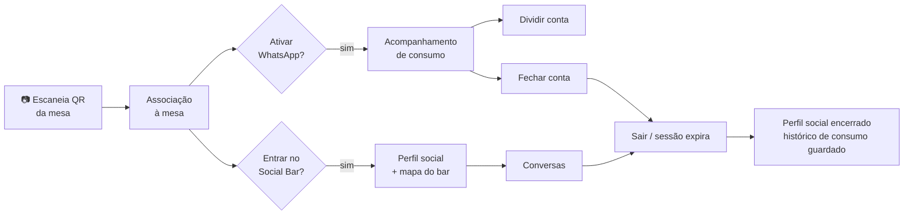

> **Princípio de design:** o cliente obtém **valor antes de qualquer cadastro pesado**. O
> primeiro lançamento aparece em segundos; a criação de perfil social é opcional e posterior.

---

## 3.2 Fluxo de Onboarding (escanear QR → associação)

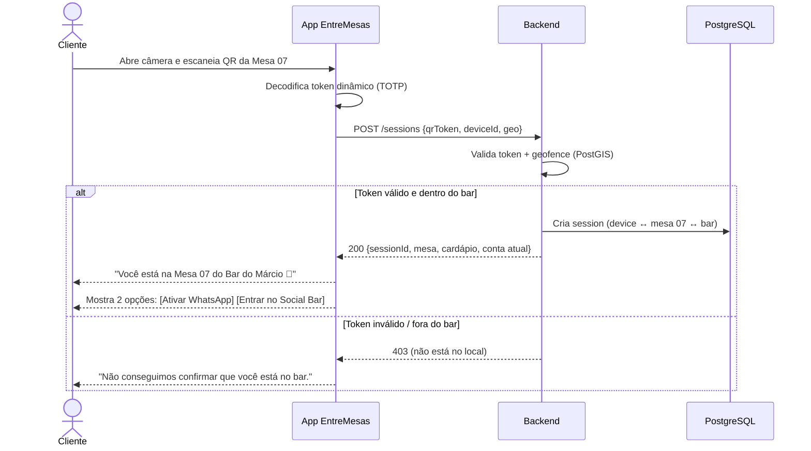

**Estados da tela inicial pós-scan:**
- Cabeçalho: nome do bar + número da mesa.
- Cartão de conta: "R$ 0,00" (ou valor atual se a mesa já tem consumo).
- Dois CTAs claros: **Acompanhar pelo WhatsApp** e **Conhecer o Social Bar**.
- Rodapé: "Sua privacidade é levada a sério. [Saiba como]".

---

## 3.3 Fluxo de Opt-in do WhatsApp

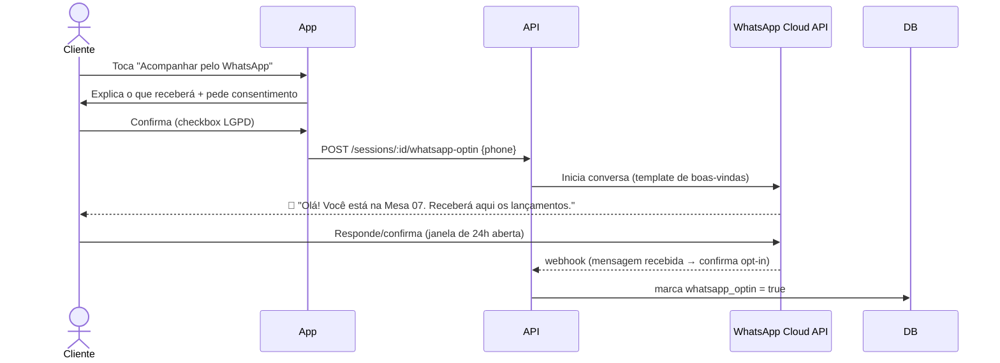

> Detalhes técnicos de templates, janela de 24h e custos em
> [10 — Integração WhatsApp](./10-integracao-whatsapp.md).

---

## 3.4 Fluxo de Consumo em Tempo Real (núcleo do Módulo 1)

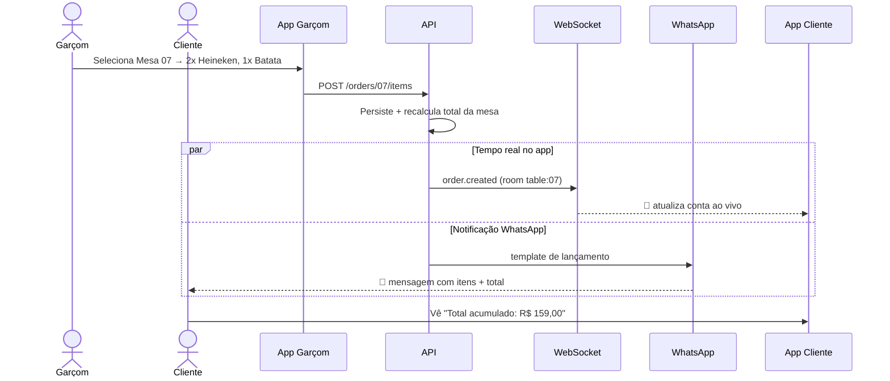

**Conteúdo da notificação (exemplo real):**
```
🧾 Novo lançamento — Mesa 07

• 2x Cerveja Heineken — R$ 24,00
• 1x Batata Frita — R$ 35,00

💰 Total acumulado da mesa: R$ 159,00
🕒 21:43

Ver conta completa ▸ entremesas.app/m/07
```

---

## 3.5 Fluxo de Divisão de Conta

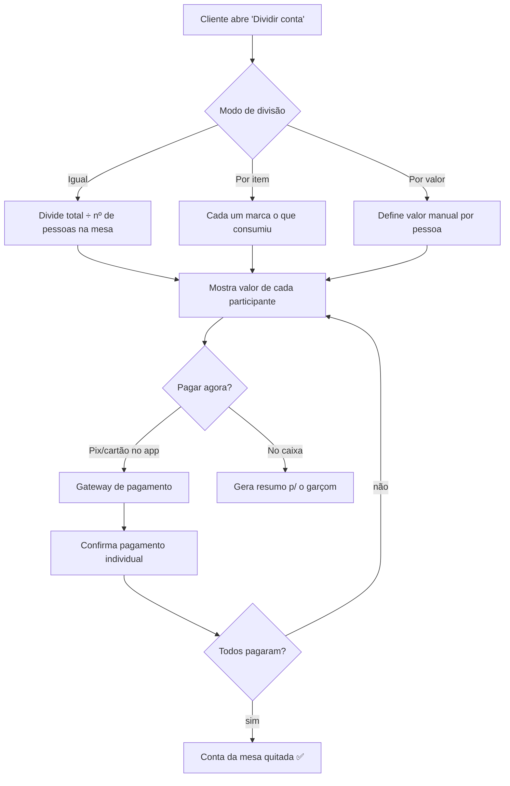

**Regras-chave:**
- A divisão é **colaborativa**: cada participante na mesa vê e confirma sua parte.
- "Por item" usa os `order_items` reais — sem digitação manual de produtos.
- Itens compartilhados (ex.: a porção de batata) podem ser rateados entre quem marcar.
- A conta só é considerada quitada quando a soma das partes = total da mesa.

---

## 3.6 Fluxo de Contestação de Lançamento

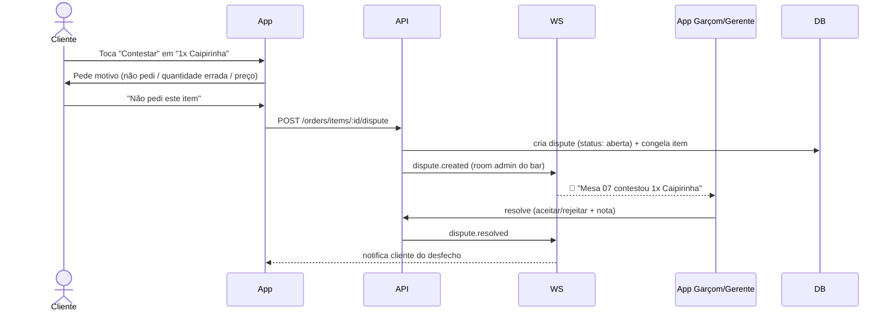

> Contestar **não** remove o item automaticamente — ele entra em estado "em revisão" e
> exige decisão da equipe, preservando o controle do estabelecimento e o histórico.

---

## 3.7 Fluxo de Chamar Garçom

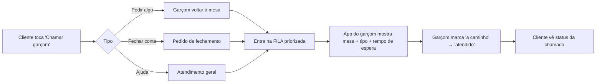

A fila prioriza por **tempo de espera** e **tipo** (fechamento e contestação acima de
chamadas genéricas), evitando que mesas fiquem esquecidas.

---

## 3.8 Fluxo de Fechamento da Conta

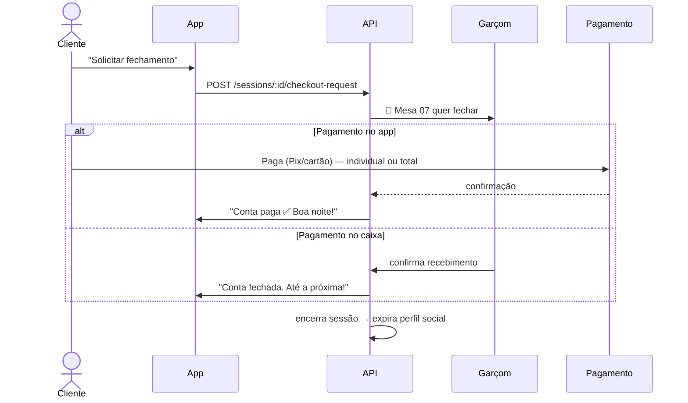

---

## 3.9 Fluxo do Social Bar (opt-in → conexão)

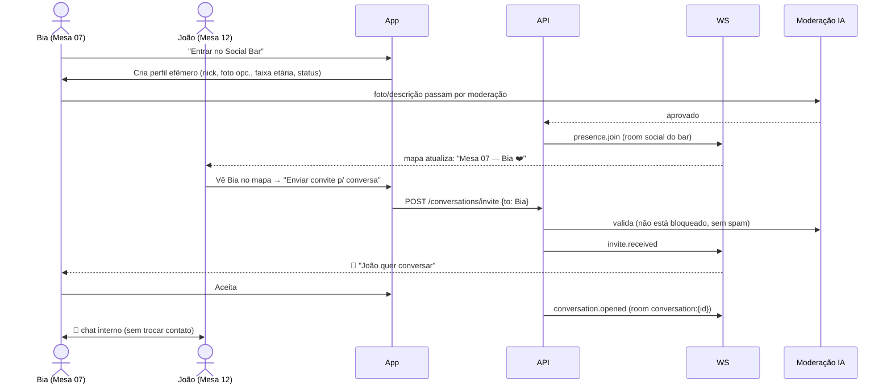

**Salvaguardas embutidas no fluxo:**
- Status `🚫 Não disponível` esconde o usuário de convites.
- Convite passa por checagem de bloqueio e *rate limit* (antispam).
- Toda mensagem é moderada (texto e imagem) antes/ao ser entregue.
- Botões **Bloquear** e **Denunciar** sempre acessíveis no chat.

---

## 3.10 Fluxo de Denúncia e Bloqueio

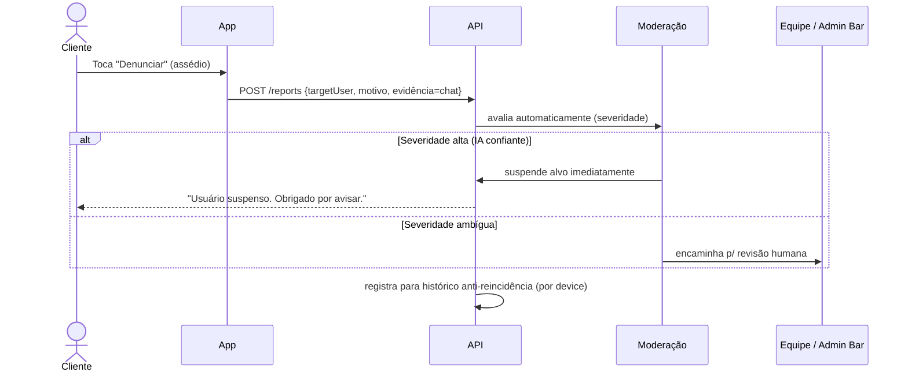

- **Bloqueio** é instantâneo e unilateral: some do mapa e do chat um do outro.
- **Banimento por device** impede que o agressor crie novo perfil na mesma noite/local.

---

## 3.11 Fluxo do Garçom (operação)

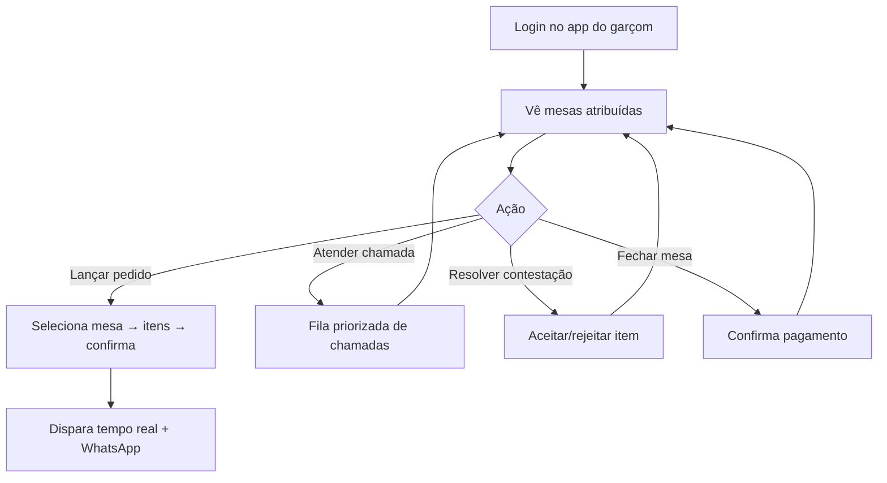

---

## 3.12 Fluxo do Proprietário (gestão)

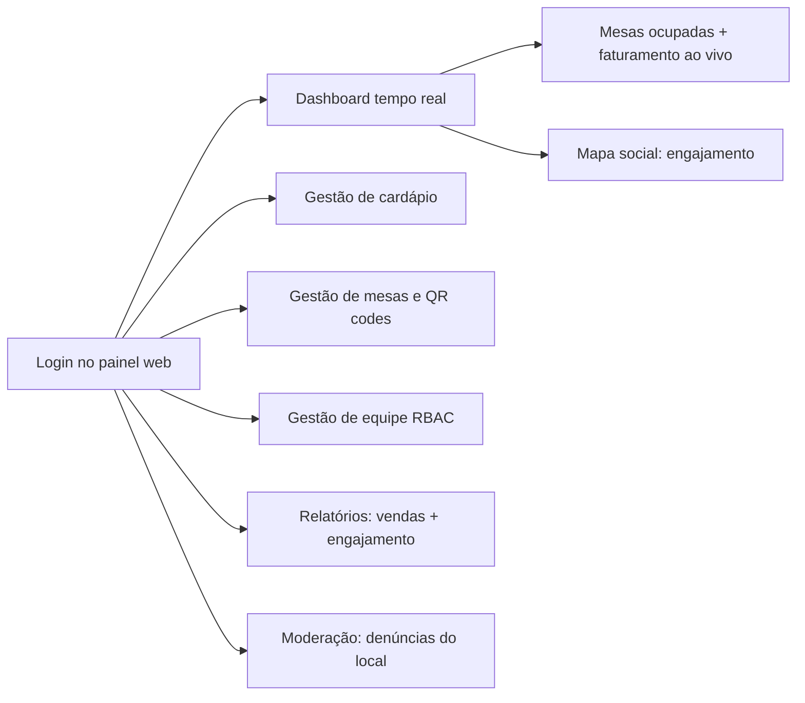

> Telas detalhadas em [08 — Wireframes](./08-wireframes.md) e métricas em
> [07 — Painel Administrativo](./07-painel-admin.md).

---

← [Anterior: Arquitetura](./02-arquitetura.md) | [Próximo: Banco de Dados →](./04-banco-de-dados.md)
