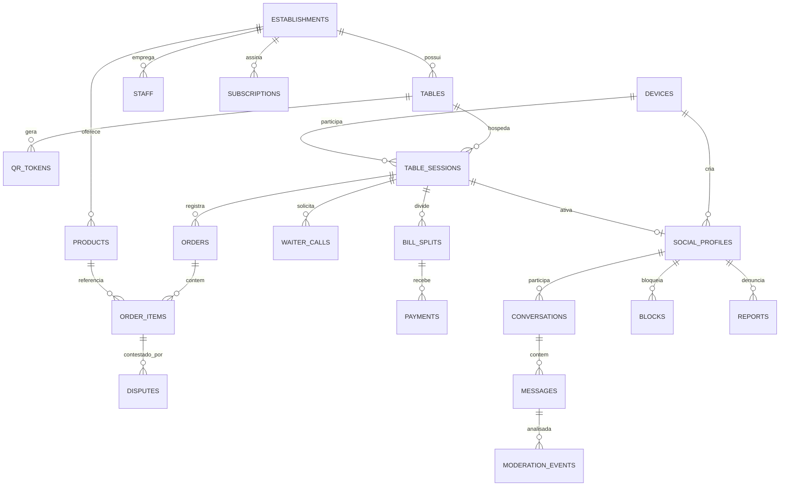

# 04 — Banco de Dados

← [Voltar ao índice](../README.md)

PostgreSQL 15+ com extensões **PostGIS** (geofence/geo) e **pgcrypto** (UUID/criptografia).
Multi-tenant por `establishment_id`. Dados sociais são **efêmeros** (ver §4.6 — retenção).

---

## 4.1 Diagrama Entidade-Relacionamento (visão lógica)



---

## 4.2 Domínio: Estabelecimento e Cardápio

```sql
CREATE EXTENSION IF NOT EXISTS pgcrypto;
CREATE EXTENSION IF NOT EXISTS postgis;

-- Estabelecimentos (tenants)
CREATE TABLE establishments (
    id              UUID PRIMARY KEY DEFAULT gen_random_uuid(),
    name            TEXT NOT NULL,
    legal_name      TEXT,
    cnpj            VARCHAR(14) UNIQUE,
    timezone        TEXT NOT NULL DEFAULT 'America/Sao_Paulo',
    -- polígono físico do local para verificação de presença (geofence)
    geofence        GEOGRAPHY(POLYGON, 4326),
    centroid        GEOGRAPHY(POINT, 4326),
    pdv_integration JSONB,          -- {provider, credentials_ref, mode}
    settings        JSONB NOT NULL DEFAULT '{}', -- features habilitadas, social on/off
    status          TEXT NOT NULL DEFAULT 'active', -- active|suspended|trial
    created_at      TIMESTAMPTZ NOT NULL DEFAULT now(),
    updated_at      TIMESTAMPTZ NOT NULL DEFAULT now()
);

-- Layout do salão (mesas)
CREATE TABLE tables (
    id              UUID PRIMARY KEY DEFAULT gen_random_uuid(),
    establishment_id UUID NOT NULL REFERENCES establishments(id) ON DELETE CASCADE,
    label           TEXT NOT NULL,          -- "07", "Balcão 3", "Camarote A"
    capacity        SMALLINT,
    -- posição no mapa do bar (coordenadas relativas para o desenho do salão)
    map_x           NUMERIC(6,2),
    map_y           NUMERIC(6,2),
    zone            TEXT,                   -- "área externa", "mezanino"
    status          TEXT NOT NULL DEFAULT 'free', -- free|occupied|reserved|disabled
    created_at      TIMESTAMPTZ NOT NULL DEFAULT now(),
    UNIQUE (establishment_id, label)
);

-- Cardápio
CREATE TABLE product_categories (
    id              UUID PRIMARY KEY DEFAULT gen_random_uuid(),
    establishment_id UUID NOT NULL REFERENCES establishments(id) ON DELETE CASCADE,
    name            TEXT NOT NULL,
    sort_order      SMALLINT DEFAULT 0
);

CREATE TABLE products (
    id              UUID PRIMARY KEY DEFAULT gen_random_uuid(),
    establishment_id UUID NOT NULL REFERENCES establishments(id) ON DELETE CASCADE,
    category_id     UUID REFERENCES product_categories(id) ON DELETE SET NULL,
    name            TEXT NOT NULL,
    description     TEXT,
    price_cents     INTEGER NOT NULL CHECK (price_cents >= 0), -- sempre em centavos
    image_url       TEXT,
    is_available    BOOLEAN NOT NULL DEFAULT true,
    external_ref    TEXT,                   -- id do produto no PDV
    created_at      TIMESTAMPTZ NOT NULL DEFAULT now(),
    updated_at      TIMESTAMPTZ NOT NULL DEFAULT now()
);
```

> **Convenção:** valores monetários sempre em **centavos (INTEGER)** para evitar erros de
> ponto flutuante. Formatação para "R$ 24,00" é responsabilidade da camada de apresentação.

---

## 4.3 Domínio: Equipe e Assinatura

```sql
CREATE TABLE staff (
    id              UUID PRIMARY KEY DEFAULT gen_random_uuid(),
    establishment_id UUID NOT NULL REFERENCES establishments(id) ON DELETE CASCADE,
    name            TEXT NOT NULL,
    email           CITEXT UNIQUE,
    password_hash   TEXT,
    role            TEXT NOT NULL DEFAULT 'waiter', -- owner|manager|waiter|cashier
    is_active       BOOLEAN NOT NULL DEFAULT true,
    created_at      TIMESTAMPTZ NOT NULL DEFAULT now()
);

-- atribuição de mesas a garçons (turno)
CREATE TABLE table_assignments (
    id              UUID PRIMARY KEY DEFAULT gen_random_uuid(),
    table_id        UUID NOT NULL REFERENCES tables(id) ON DELETE CASCADE,
    staff_id        UUID NOT NULL REFERENCES staff(id) ON DELETE CASCADE,
    active          BOOLEAN NOT NULL DEFAULT true,
    assigned_at     TIMESTAMPTZ NOT NULL DEFAULT now()
);

CREATE TABLE subscriptions (
    id              UUID PRIMARY KEY DEFAULT gen_random_uuid(),
    establishment_id UUID NOT NULL REFERENCES establishments(id) ON DELETE CASCADE,
    plan            TEXT NOT NULL,          -- start|pro|night (ver doc 11)
    status          TEXT NOT NULL,          -- trialing|active|past_due|canceled
    monthly_price_cents INTEGER NOT NULL,
    current_period_end TIMESTAMPTZ,
    created_at      TIMESTAMPTZ NOT NULL DEFAULT now()
);
```

---

## 4.4 Domínio: Sessão, Consumo e Pagamento

```sql
-- Identidade anônima persistente do aparelho
CREATE TABLE devices (
    id              UUID PRIMARY KEY DEFAULT gen_random_uuid(),
    device_uid      TEXT NOT NULL UNIQUE,   -- id estável do app (keystore/keychain)
    push_token      TEXT,                   -- FCM/APNs
    phone_e164      TEXT,                   -- guardado só se opt-in WhatsApp (criptografado)
    is_banned       BOOLEAN NOT NULL DEFAULT false,
    banned_until    TIMESTAMPTZ,
    created_at      TIMESTAMPTZ NOT NULL DEFAULT now()
);

-- QR tokens dinâmicos (TOTP) por mesa
CREATE TABLE qr_tokens (
    id              UUID PRIMARY KEY DEFAULT gen_random_uuid(),
    table_id        UUID NOT NULL REFERENCES tables(id) ON DELETE CASCADE,
    secret          BYTEA NOT NULL,         -- segredo TOTP da mesa (criptografado)
    rotated_at      TIMESTAMPTZ NOT NULL DEFAULT now()
);

-- Sessão de mesa (efêmera, dura a visita)
CREATE TABLE table_sessions (
    id              UUID PRIMARY KEY DEFAULT gen_random_uuid(),
    establishment_id UUID NOT NULL REFERENCES establishments(id) ON DELETE CASCADE,
    table_id        UUID NOT NULL REFERENCES tables(id),
    device_id       UUID NOT NULL REFERENCES devices(id),
    role            TEXT NOT NULL DEFAULT 'guest', -- guest|host (quem abriu a mesa)
    whatsapp_optin  BOOLEAN NOT NULL DEFAULT false,
    social_optin    BOOLEAN NOT NULL DEFAULT false,
    joined_geo      GEOGRAPHY(POINT, 4326), -- posição no opt-in (verificação)
    status          TEXT NOT NULL DEFAULT 'active', -- active|closed|expired
    started_at      TIMESTAMPTZ NOT NULL DEFAULT now(),
    last_seen_at    TIMESTAMPTZ NOT NULL DEFAULT now(), -- heartbeat
    ended_at        TIMESTAMPTZ
);
CREATE INDEX idx_sessions_active ON table_sessions (establishment_id, status)
    WHERE status = 'active';

-- Conta da mesa (1 conta aberta por mesa ativa)
CREATE TABLE orders (
    id              UUID PRIMARY KEY DEFAULT gen_random_uuid(),
    establishment_id UUID NOT NULL REFERENCES establishments(id),
    table_id        UUID NOT NULL REFERENCES tables(id),
    status          TEXT NOT NULL DEFAULT 'open', -- open|closing|paid|canceled
    total_cents     INTEGER NOT NULL DEFAULT 0,   -- desnormalizado p/ leitura rápida
    opened_at       TIMESTAMPTZ NOT NULL DEFAULT now(),
    closed_at       TIMESTAMPTZ
);
CREATE UNIQUE INDEX uq_order_open_per_table ON orders (table_id)
    WHERE status IN ('open','closing');

-- Itens lançados (cada lançamento do garçom)
CREATE TABLE order_items (
    id              UUID PRIMARY KEY DEFAULT gen_random_uuid(),
    order_id        UUID NOT NULL REFERENCES orders(id) ON DELETE CASCADE,
    product_id      UUID REFERENCES products(id),
    product_name    TEXT NOT NULL,          -- snapshot (preço/nome no momento)
    quantity        SMALLINT NOT NULL CHECK (quantity > 0),
    unit_price_cents INTEGER NOT NULL,
    line_total_cents INTEGER NOT NULL,
    launched_by     UUID REFERENCES staff(id),
    status          TEXT NOT NULL DEFAULT 'active', -- active|disputed|voided
    note            TEXT,
    created_at      TIMESTAMPTZ NOT NULL DEFAULT now()
) PARTITION BY RANGE (created_at);
-- partições mensais (ver §4.7)

-- Contestações
CREATE TABLE disputes (
    id              UUID PRIMARY KEY DEFAULT gen_random_uuid(),
    order_item_id   UUID NOT NULL REFERENCES order_items(id),
    session_id      UUID NOT NULL REFERENCES table_sessions(id),
    reason          TEXT NOT NULL,          -- not_ordered|wrong_qty|wrong_price|other
    detail          TEXT,
    status          TEXT NOT NULL DEFAULT 'open', -- open|accepted|rejected
    resolved_by     UUID REFERENCES staff(id),
    resolved_at     TIMESTAMPTZ,
    created_at      TIMESTAMPTZ NOT NULL DEFAULT now()
);

-- Chamadas de garçom
CREATE TABLE waiter_calls (
    id              UUID PRIMARY KEY DEFAULT gen_random_uuid(),
    session_id      UUID NOT NULL REFERENCES table_sessions(id),
    table_id        UUID NOT NULL REFERENCES tables(id),
    type            TEXT NOT NULL,          -- service|checkout|help
    status          TEXT NOT NULL DEFAULT 'pending', -- pending|enroute|done
    priority        SMALLINT NOT NULL DEFAULT 0,
    created_at      TIMESTAMPTZ NOT NULL DEFAULT now(),
    handled_by      UUID REFERENCES staff(id),
    handled_at      TIMESTAMPTZ
);

-- Divisão de conta
CREATE TABLE bill_splits (
    id              UUID PRIMARY KEY DEFAULT gen_random_uuid(),
    order_id        UUID NOT NULL REFERENCES orders(id),
    mode            TEXT NOT NULL,          -- equal|by_item|by_amount
    created_by      UUID REFERENCES devices(id),
    created_at      TIMESTAMPTZ NOT NULL DEFAULT now()
);

CREATE TABLE bill_split_shares (
    id              UUID PRIMARY KEY DEFAULT gen_random_uuid(),
    split_id        UUID NOT NULL REFERENCES bill_splits(id) ON DELETE CASCADE,
    device_id       UUID REFERENCES devices(id),
    label           TEXT,                   -- "Pessoa 2" quando anônimo
    amount_cents    INTEGER NOT NULL,
    paid            BOOLEAN NOT NULL DEFAULT false
);

-- Pagamentos
CREATE TABLE payments (
    id              UUID PRIMARY KEY DEFAULT gen_random_uuid(),
    order_id        UUID NOT NULL REFERENCES orders(id),
    split_share_id  UUID REFERENCES bill_split_shares(id),
    method          TEXT NOT NULL,          -- pix|credit|debit|cash
    amount_cents    INTEGER NOT NULL,
    gateway_ref     TEXT,
    status          TEXT NOT NULL DEFAULT 'pending', -- pending|paid|failed|refunded
    created_at      TIMESTAMPTZ NOT NULL DEFAULT now(),
    paid_at         TIMESTAMPTZ
);
```

### Trigger: manter `orders.total_cents` consistente
```sql
CREATE OR REPLACE FUNCTION recalc_order_total() RETURNS TRIGGER AS $$
BEGIN
    UPDATE orders o
    SET total_cents = COALESCE((
        SELECT SUM(line_total_cents)
        FROM order_items
        WHERE order_id = o.id AND status = 'active'
    ), 0)
    WHERE o.id = COALESCE(NEW.order_id, OLD.order_id);
    RETURN NULL;
END; $$ LANGUAGE plpgsql;

CREATE TRIGGER trg_recalc_total
AFTER INSERT OR UPDATE OR DELETE ON order_items
FOR EACH ROW EXECUTE FUNCTION recalc_order_total();
```

---

## 4.5 Domínio: Social Bar (efêmero)

```sql
-- Perfil social efêmero (vinculado à sessão de mesa)
CREATE TABLE social_profiles (
    id              UUID PRIMARY KEY DEFAULT gen_random_uuid(),
    session_id      UUID NOT NULL REFERENCES table_sessions(id) ON DELETE CASCADE,
    establishment_id UUID NOT NULL REFERENCES establishments(id),
    device_id       UUID NOT NULL REFERENCES devices(id),
    nickname        TEXT NOT NULL,
    photo_url       TEXT,                   -- opcional, S3, moderada
    age_range       TEXT NOT NULL,          -- 18-24|25-34|35-44|45+
    bio             TEXT,                   -- breve descrição (limite curto)
    interests       TEXT[] NOT NULL DEFAULT '{}',
    status          TEXT NOT NULL,          -- serious|flirt|casual|friends|night|unavailable
    visible         BOOLEAN NOT NULL DEFAULT true,
    created_at      TIMESTAMPTZ NOT NULL DEFAULT now(),
    expires_at      TIMESTAMPTZ NOT NULL    -- TTL; encerra ao sair do local
);
CREATE INDEX idx_social_active ON social_profiles (establishment_id)
    WHERE visible = true;

-- Conversas internas (sem expor contato real)
CREATE TABLE conversations (
    id              UUID PRIMARY KEY DEFAULT gen_random_uuid(),
    establishment_id UUID NOT NULL REFERENCES establishments(id),
    profile_a       UUID NOT NULL REFERENCES social_profiles(id) ON DELETE CASCADE,
    profile_b       UUID NOT NULL REFERENCES social_profiles(id) ON DELETE CASCADE,
    status          TEXT NOT NULL DEFAULT 'pending', -- pending|open|declined|closed
    created_at      TIMESTAMPTZ NOT NULL DEFAULT now(),
    UNIQUE (profile_a, profile_b)
);

CREATE TABLE messages (
    id              UUID PRIMARY KEY DEFAULT gen_random_uuid(),
    conversation_id UUID NOT NULL REFERENCES conversations(id) ON DELETE CASCADE,
    sender_profile  UUID NOT NULL REFERENCES social_profiles(id),
    body            TEXT,
    media_url       TEXT,
    moderation_status TEXT NOT NULL DEFAULT 'pending', -- pending|approved|blocked
    created_at      TIMESTAMPTZ NOT NULL DEFAULT now()
) PARTITION BY RANGE (created_at);

CREATE TABLE blocks (
    id              UUID PRIMARY KEY DEFAULT gen_random_uuid(),
    blocker_device  UUID NOT NULL REFERENCES devices(id),
    blocked_device  UUID NOT NULL REFERENCES devices(id),
    created_at      TIMESTAMPTZ NOT NULL DEFAULT now(),
    UNIQUE (blocker_device, blocked_device)
);

CREATE TABLE reports (
    id              UUID PRIMARY KEY DEFAULT gen_random_uuid(),
    establishment_id UUID NOT NULL REFERENCES establishments(id),
    reporter_device UUID NOT NULL REFERENCES devices(id),
    target_device   UUID NOT NULL REFERENCES devices(id),
    category        TEXT NOT NULL,          -- harassment|spam|fake|offensive|other
    detail          TEXT,
    evidence        JSONB,                  -- ids de mensagens, snapshot
    severity        SMALLINT,               -- atribuída pela IA (0-100)
    status          TEXT NOT NULL DEFAULT 'open', -- open|auto_actioned|reviewed|dismissed
    created_at      TIMESTAMPTZ NOT NULL DEFAULT now()
);

CREATE TABLE moderation_events (
    id              UUID PRIMARY KEY DEFAULT gen_random_uuid(),
    subject_type    TEXT NOT NULL,          -- message|photo|bio|nickname
    subject_id      UUID,
    device_id       UUID REFERENCES devices(id),
    decision        TEXT NOT NULL,          -- approved|flagged|blocked
    categories      JSONB,                  -- {harassment:0.9, sexual:0.1,...}
    model           TEXT,
    created_at      TIMESTAMPTZ NOT NULL DEFAULT now()
);
```

---

## 4.6 Política de Retenção de Dados (Privacidade by design)

| Dado | Retenção | Justificativa |
|---|---|---|
| `social_profiles` | **Apagado/anônimo ao expirar a sessão** (job) | Efemeridade — princípio central |
| `messages` (conteúdo) | **Apagado em até 24h** após fim da sessão | Conversa não persiste fora do bar |
| `conversations` | Metadado mínimo por 30 dias (anti-reincidência) | Segurança sem reter conteúdo |
| `reports` / `moderation_events` | 12 meses (anonimizado) | Obrigação de segurança/auditoria |
| `devices.phone_e164` | Apagado se sem opt-in; criptografado se com | LGPD — minimização |
| `orders` / `order_items` | Retidos (fiscal/contábil do bar) | Obrigação legal do estabelecimento |
| `payments` | Conforme exigência fiscal | Legal |

> Job diário (`data-retention.worker`) executa anonimização e expurgo. O conteúdo de chat
> nunca é exposto ao bar; apenas evidências de denúncia (limitadas) à equipe de moderação.

---

## 4.7 Particionamento e Índices

- `order_items` e `messages` particionadas por **mês** (`RANGE (created_at)`): inserts
  rápidos, expurgo barato (DROP PARTITION), consultas recentes eficientes.
- Índices principais:
  - `order_items (order_id, status)` — montar a conta.
  - `table_sessions (establishment_id, status) WHERE active` — mesas ocupadas.
  - `social_profiles (establishment_id) WHERE visible` — mapa social.
  - `waiter_calls (table_id, status)` — fila de chamadas.
  - GiST em `establishments.geofence` e `table_sessions.joined_geo` (PostGIS).

### Exemplo: verificação de geofence (presença real)
```sql
-- retorna true se o ponto do cliente está dentro do polígono do bar (+ tolerância 20m)
SELECT ST_DWithin(e.geofence, ST_MakePoint(:lng, :lat)::geography, 20)
FROM establishments e WHERE e.id = :establishment_id;
```

---

## 4.8 Consultas Representativas

```sql
-- Conta em tempo real de uma mesa
SELECT oi.product_name, oi.quantity, oi.unit_price_cents, oi.line_total_cents
FROM order_items oi
JOIN orders o ON o.id = oi.order_id
WHERE o.table_id = :table_id AND o.status = 'open' AND oi.status = 'active'
ORDER BY oi.created_at;

-- Faturamento ao vivo do estabelecimento (dashboard)
SELECT COUNT(*) FILTER (WHERE status='open') AS contas_abertas,
       COALESCE(SUM(total_cents) FILTER (WHERE status IN ('open','closing')),0) AS em_aberto_cents,
       COALESCE(SUM(total_cents) FILTER (WHERE status='paid' AND closed_at::date = current_date),0) AS faturado_hoje_cents
FROM orders WHERE establishment_id = :est_id;

-- Mapa social: mesas com pessoas e status predominante
SELECT t.label,
       COUNT(sp.id) AS pessoas,
       MODE() WITHIN GROUP (ORDER BY sp.status) AS status_predominante
FROM tables t
JOIN table_sessions ts ON ts.table_id = t.id AND ts.status='active'
JOIN social_profiles sp ON sp.session_id = ts.id AND sp.visible
WHERE t.establishment_id = :est_id
GROUP BY t.label;
```

---

## 4.9 Segurança no Banco

- **Row-Level Security (RLS)** opcional por `establishment_id` (defesa extra multi-tenant).
- Colunas sensíveis (`phone_e164`, `qr_tokens.secret`) **criptografadas** (pgcrypto / KMS).
- Conexões via IAM auth no RDS; segredos no Secrets Manager.
- Backups com **PITR**; testes de restauração periódicos.

---

← [Anterior: Fluxos](./03-fluxos-usuario.md) | [Próximo: Módulo de Consumo →](./05-modulo-consumo.md)
