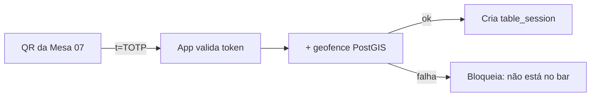

# 05 — Módulo 1: Acompanhamento de Consumo em Tempo Real

← [Voltar ao índice](../README.md)

> Núcleo de valor "racional" do produto: **transparência total** do consumo. Funciona mesmo
> para quem **não** ativa o Social Bar.

---

## 5.1 QR Code da Mesa

Cada mesa tem um QR exclusivo, impresso (adesivo de mesa / display de acrílico).

### QR dinâmico (anti-fraude)
- O QR **não** codifica uma URL fixa adivinhável. Ele aponta para
  `https://entremesas.app/m/{tablePublicId}?t={totpToken}`.
- `totpToken` é um **TOTP** derivado do segredo da mesa (`qr_tokens.secret`), com janela de
  validade. Em mesas com display eletrônico, o token rotaciona; em adesivo estático, usamos
  janela mais longa + geofence como segundo fator.
- Ao abrir, o app valida token **e** geofence (ver [02 §2.6](./02-arquitetura.md)).



### Fallback sem app instalado
- O link abre uma **PWA leve** no navegador (deep link tenta abrir o app; se não houver,
  PWA permite acompanhar a conta e ativar WhatsApp). Reduz fricção do primeiro uso.

---

## 5.2 Lançamento de Itens

### Origem dos lançamentos
1. **App do garçom** (EntreMesas como comanda).
2. **Webhook do PDV** (EntreMesas como camada de transparência).

### Regras
- Cada lançamento cria 1+ `order_items` na `order` aberta da mesa.
- Preço e nome são **snapshot** (congelados no momento), preservando a conta mesmo se o
  cardápio mudar.
- Recalcula `orders.total_cents` (trigger) e dispara eventos (WebSocket + fila WhatsApp).

### Agrupamento inteligente de notificações
Para reduzir custo de WhatsApp e ruído, lançamentos do mesmo garçom para a mesma mesa em uma
**janela de 60–90 s** são agrupados em **uma** mensagem (debounce). Lançamentos avulsos
posteriores geram nova mensagem.

---

## 5.3 Notificação de Consumo

### Canais (em ordem de preferência)
1. **App aberto** → atualização instantânea via WebSocket (sem custo).
2. **Push (FCM/APNs)** → se o app está fechado mas instalado.
3. **WhatsApp** → canal de maior alcance e confiança (opt-in).

> Estratégia: se o app está em foreground, **não** envia WhatsApp redundante (configurável);
> garante alcance sem gastar à toa.

### Anatomia da mensagem
```
🧾 Novo lançamento — Mesa 07

• 2x Cerveja Heineken — R$ 24,00
• 1x Batata Frita — R$ 35,00

💰 Total acumulado da mesa: R$ 159,00
🕒 21:43

Ver conta completa ▸ {link}
```

Campos obrigatórios (do enunciado): **nome do produto, quantidade, valor unitário, valor
total acumulado, horário**. Detalhes de template/HSM em [10 — WhatsApp](./10-integracao-whatsapp.md).

---

## 5.4 Consulta da Conta em Tempo Real

Tela "Minha Conta" (e PWA equivalente):
- Lista de itens (produto, qtd, unitário, subtotal), agrupados por rodada/horário.
- **Total acumulado** em destaque, atualizado ao vivo.
- Indicador de itens "em contestação".
- Botão de divisão e de fechamento.
- Quando há vários dispositivos na mesma mesa, todos veem a **mesma conta** (room `table:{id}`).

---

## 5.5 Histórico de Pedidos

- Durante a visita: timeline de rodadas.
- Entre visitas (por dispositivo): histórico de **visitas anteriores** ao(s) bar(es), com
  total gasto e itens — útil para "pedir o de sempre".
- Respeita retenção: histórico de consumo pertence ao dispositivo e ao bar (fiscal),
  enquanto dados sociais expiram.

---

## 5.6 Divisão de Conta

Três modos (ver fluxo em [03 §3.5](./03-fluxos-usuario.md)):

| Modo | Como funciona | Quando usar |
|---|---|---|
| **Igual** | `total ÷ nº de participantes` | Grupo que divide tudo |
| **Por item** | Cada um marca os `order_items` que consumiu; compartilhados são rateados | Consumo desigual |
| **Por valor** | Cada um define quanto paga (soma deve bater) | Casos específicos |

### Regras de consistência
- A soma das `bill_split_shares.amount_cents` **deve igualar** `orders.total_cents`.
- Sobras de arredondamento (centavos) vão para quem criou a divisão (ou configurável).
- Pagamento pode ser **individual no app** (Pix/cartão) ou consolidado no caixa.
- Conta só fica `paid` quando todas as parcelas estão quitadas.

---

## 5.7 Contestação de Lançamento

Estados de um item: `active → disputed → (accepted=voided | rejected=active)`.

- Cliente abre contestação com **motivo** (não pedi / quantidade / preço / outro).
- Item entra em **revisão** (não some sozinho — controle do bar).
- Equipe resolve no app do garçom/gerente; cliente é notificado.
- **Métricas**: taxa de contestação por garçom/produto alimentam o dashboard (qualidade
  operacional e detecção de erros recorrentes).

---

## 5.8 Chamada de Garçom

- Tipos: **serviço** (voltar à mesa), **fechamento**, **ajuda**.
- Entram em **fila priorizada** (fechamento/contestação > serviço) ordenada por espera.
- App do garçom mostra mesa, tipo, tempo aguardando; estados `pending → enroute → done`.
- Cliente vê o status ("Garçom a caminho").
- Evita o clássico aceno de braço perdido no salão lotado.

---

## 5.9 Solicitação de Fechamento

- Cliente pede fechamento → notifica equipe e (opcional) inicia pagamento no app.
- Pode fechar **a mesa inteira** ou **a sua parte** (em divisão por pessoa).
- Ao quitar e encerrar a sessão: dispara expiração do **perfil social** (efemeridade).

---

## 5.10 Casos de Borda

| Caso | Tratamento |
|---|---|
| Mesma pessoa troca de mesa | Encerra sessão antiga, cria nova ao escanear outro QR |
| Várias pessoas, uma só paga | "Host" assume a conta; demais só acompanham |
| Mesa unida (juntar mesas) | Operação de *merge* de `orders` pelo garçom |
| Item lançado na mesa errada | Garçom move item entre `orders` (auditado) |
| Conexão cai no meio | WebSocket reconecta; estado reconciliado via REST |
| Cliente sai sem pagar | Sessão expira por heartbeat; conta fica em aberto p/ o bar (alerta no painel) |

---

## 5.11 Requisitos Não-Funcionais do Módulo

- **Latência lançamento → app:** p95 < 2 s (WebSocket).
- **Latência lançamento → WhatsApp:** p95 < 5 s.
- **Consistência de valores:** garantida por transação + trigger (nunca exibir total errado).
- **Idempotência:** lançamentos do PDV com `external_ref` para evitar duplicidade em retries.

---

← [Anterior: Banco de Dados](./04-banco-de-dados.md) | [Próximo: Módulo Social →](./06-modulo-social.md)
