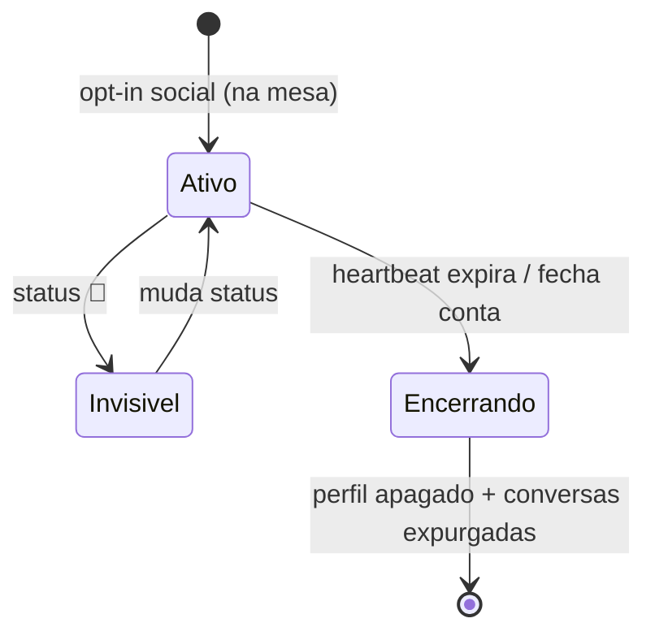

# 06 — Módulo 2: Social Bar (Rede Social Local Efêmera)

← [Voltar ao índice](../README.md)

> Diferencial emocional do produto. Uma rede social que **só existe dentro do bar e só
> enquanto você está nele** — feita para conhecer quem está ali, com **anonimato real**.

---

## 6.1 Princípios de Design

1. **Efêmero** — perfil e conversas expiram ao sair do local.
2. **Anônimo** — nunca expõe telefone, e-mail, nome real ou redes pessoais.
3. **Presencial** — só participa quem está fisicamente no bar (geofence + sessão ativa).
4. **Consentido** — opt-in separado do módulo de consumo.
5. **Seguro por padrão** — bloqueio e denúncia a um toque; moderação por IA sempre ligada.
6. **Opcional** — o consumo funciona 100% sem o social.

---

## 6.2 Perfil do Usuário (simplificado e efêmero)

| Campo | Obrigatório | Observações |
|---|---|---|
| **Nickname** | ✅ | Apelido; checado por moderação (sem ofensa/contato disfarçado) |
| **Foto** | ❌ | Opcional; passa por moderação de imagem (anti-nudez/violência) |
| **Faixa etária** | ✅ | 18-24 / 25-34 / 35-44 / 45+ (nunca data exata) |
| **Breve descrição (bio)** | ❌ | Limite curto; moderada |
| **Interesses** | ❌ | Tags (música, esportes, jogos, viagem...) p/ matching |
| **Status social** | ✅ | Ver §6.3 |

**Nunca exibido / nunca coletado para exibição:** telefone, e-mail, nome completo, redes
sociais pessoais, localização exata, dados sensíveis (art. 5º LGPD).

> **Idade:** acesso ao Social Bar é **18+**. A faixa etária é declaratória; combinada à
> natureza presencial (bar) e à moderação. Estabelecimentos podem exigir validação extra.

---

## 6.3 Status Social

Status visível escolhido pelo usuário (do enunciado):

| Emoji | Status | Significado |
|---|---|---|
| 💚 | Relacionamento sério | Procurando algo sério |
| ❤️ | Paquera | Aberto para paquera |
| 🔥 | Casual | Algo casual |
| 🤝 | Amizade / Networking | Novas amizades |
| 🎉 | Curtindo a noite | Sem interesse romântico, só clima |
| 🚫 | Não disponível | Invisível para convites |

- O status colore o avatar no mapa e habilita/desabilita convites.
- `🚫 Não disponível` torna o perfil **invisível** (sai do mapa) — botão de pânico social.
- Mudança de status é instantânea (WebSocket → mapa atualiza para todos).

---

## 6.4 Visualização das Mesas (Mapa do Bar)

Mapa simplificado do salão usando `tables.map_x/map_y/zone`:

```
        ┌──────────── BAR DO MÁRCIO ────────────┐
        │   [Mesa 03]        [Mesa 05]           │
        │    😎😎 🎉          (vazia)            │
        │                                        │
        │   [Mesa 07] ❤️      [Mesa 12] 💚       │
        │    Ana ❤️           Carlos 💚          │
        │    João 🤝          Mariana ❤️         │
        │                                        │
        │   [Balcão] 🔥🔥🤝                      │
        └────────────────────────────────────────┘
              filtros: [Todos] [❤️] [🤝] [interesses]
```

Cada mesa mostra (do enunciado):
- **Número da mesa**.
- **Quantidade de pessoas** conectadas ao social.
- **Status predominante** da mesa (`MODE()` dos status).
- **Usuários conectados** (nickname + status), ao tocar.

**Exemplo (do enunciado):**
```
Mesa 07
• Ana (Paquera ❤️)
• João (Amizade 🤝)

Mesa 12
• Carlos (Relacionamento sério 💚)
• Mariana (Paquera ❤️)
```

### Interações no mapa
- Tocar numa pessoa → mini-perfil (nick, foto opc., faixa, bio, interesses, status).
- Botão **Enviar convite para conversa**.
- Filtros: por status, por interesses, "perto de mim" (mesas próximas via `map_x/y`).
- Privacidade: você pode aparecer só para certos status (ex.: só quem busca 🤝).

---

## 6.5 Sistema de Conversas

Fluxo: **convite → aceite/recusa → chat interno** (ver [03 §3.9](./03-fluxos-usuario.md)).

| Recurso | Detalhe |
|---|---|
| Enviar convite | Sujeito a *rate limit* (antispam) e checagem de bloqueio |
| Aceitar / recusar | Recusa é silenciosa; sem "vexame" para quem convidou |
| Chat interno | Texto + imagem (moderada); sem troca de contato |
| Indicadores | "digitando…", "visto", entrega |
| Bloquear | Instantâneo, unilateral, mútuo no efeito (somem um do outro) |
| Denunciar | A um toque, anexa contexto do chat como evidência |

**Garantia central:** nenhuma mensagem revela contato real. Se as pessoas quiserem se
encontrar/trocar número, fazem isso **pessoalmente** — o app só aproxima.

### Expiração da conversa
- Conversa fica ativa enquanto **ambos** estão presentes.
- Se um sai (sessão expira), a conversa entra em "encerrando"; conteúdo é apagado conforme
  retenção (ver [04 §4.6](./04-banco-de-dados.md)).

---

## 6.6 Matching e Descoberta

- **Discovery passivo:** mapa do bar (quem está onde, com qual status).
- **Sugestões:** pessoas com **interesses em comum** e status compatível em destaque.
- **Compatibilidade de status:** ex.: 💚 vê preferencialmente 💚/❤️; 🤝 vê 🤝/🎉. Evita
  ruído e desencontro de intenção.
- **Sem swipe infinito:** o foco é o ambiente real, não scroll viciante — alinhado ao
  posicionamento "viva o bar, não o celular".

---

## 6.7 Verificação de Presença e Efemeridade

- Entrar no social exige **sessão de mesa ativa** (escaneou QR + geofence).
- **Heartbeat** mantém presença; sem heartbeat → TTL expira → sai do mapa.
- Sair do bar / fechar conta → **perfil encerrado automaticamente** (job `session-expiry`).
- Não há "perfil permanente" para garimpar — reduz catfishing e perseguição.



---

## 6.8 Segurança e Antiassédio (resumo)

> Especificação completa em [09 — Segurança e Privacidade](./09-seguranca-privacidade.md).

- **Moderação por IA** de nickname, bio, foto e **toda mensagem** (texto + imagem).
- **Denúncia** com triagem automática de severidade; ação imediata em casos graves.
- **Bloqueio** instantâneo; **banimento por device** impede recriação no mesmo local/noite.
- **Antispam:** limites de convites/mensagens por janela de tempo.
- **Modo "só amizade/networking"** para quem não quer contexto de paquera.
- **Pânico:** 🚫 torna invisível na hora; "sair do social" mantém só o módulo de consumo.

---

## 6.9 Gamificação leve (engajamento saudável)

Opcional, para aumentar permanência **sem** ser manipulativo:
- **Quebra-gelos:** sugestões de primeira mensagem baseadas em interesses comuns.
- **Selos da casa:** "Cliente da casa" (visitas recorrentes) — exibe reputação, não dados.
- **Dinâmicas do bar:** o estabelecimento pode lançar enquetes/temas da noite no mapa.

> Princípio: gamificar a **conexão presencial**, nunca o tempo de tela isolado.

---

## 6.10 Requisitos Não-Funcionais do Módulo

- **Atualização do mapa:** p95 < 1,5 s após mudança de presença/status.
- **Moderação de mensagem:** decisão antes da entrega; p95 < 1 s (com fallback "entregar e
  revisar" para texto claramente benigno, conforme política de risco).
- **Privacidade:** nenhum endpoint expõe `phone_e164`, device real ou geo exata a outro usuário.
- **Disponibilidade do social não afeta o consumo** (módulos desacoplados).

---

← [Anterior: Módulo Consumo](./05-modulo-consumo.md) | [Próximo: Painel Admin →](./07-painel-admin.md)
