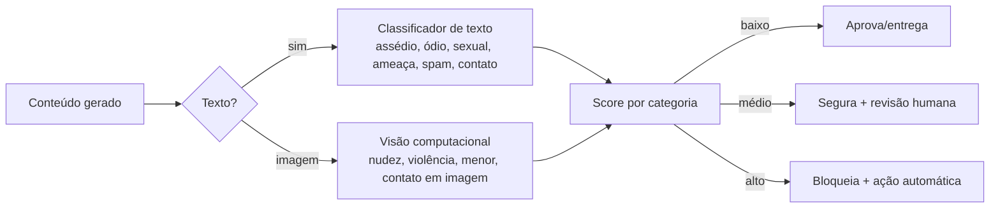

# 09 — Segurança e Privacidade

← [Voltar ao índice](../README.md)

> Para um produto que mistura **dinheiro** (consumo) e **interação social entre estranhos**,
> segurança e privacidade não são features — são pré-condição de existência. Esta é a área
> de maior risco reputacional e legal.

---

## 9.1 Princípios (LGPD by design)

| Princípio LGPD (art. 6º) | Como aplicamos |
|---|---|
| **Finalidade** | Dados usados só para consumo e interação local declarados |
| **Minimização** | Coletamos o mínimo; faixa etária (não data), nick (não nome) |
| **Necessidade** | Telefone só com opt-in WhatsApp; geo só para verificar presença |
| **Livre acesso** | Usuário vê e exporta seus dados; apaga quando quiser |
| **Transparência** | Linguagem clara no opt-in; política acessível |
| **Segurança** | Criptografia, RBAC, auditoria |
| **Não discriminação** | Sem uso de dados para fins discriminatórios |
| **Responsabilização** | DPO, registros de tratamento, resposta a incidentes |

**Base legal:** consentimento (art. 7º, I) para WhatsApp e Social Bar (granulares e
revogáveis); legítimo interesse/execução de contrato para a transparência de consumo
solicitada pelo próprio cliente.

---

## 9.2 O que NUNCA é exposto entre usuários

```
┌──────────────────────────────────────────────┐
│  ❌ Telefone        ❌ E-mail                  │
│  ❌ Nome completo   ❌ Redes sociais pessoais  │
│  ❌ Localização exata ❌ Dados sensíveis       │
│  ❌ Identidade do dispositivo                  │
│                                                │
│  ✅ Apenas: nick, foto opcional (moderada),    │
│     faixa etária, bio curta, interesses, status│
└──────────────────────────────────────────────┘
```

Toda interação acontece **dentro da plataforma**. Não há "ver perfil no Instagram", não há
botão de "trocar número". Se as pessoas quiserem, trocam contatos **pessoalmente**.

---

## 9.3 Efemeridade (dado que não existe não vaza)

- **Perfil social** e **conversas** expiram ao sair do bar (ver retenção em [04 §4.6](./04-banco-de-dados.md)).
- Não há histórico social navegável entre visitas → reduz **stalking**, **catfishing** e
  superfície de vazamento.
- Conteúdo de chat é apagado; só restam **metadados mínimos** anti-reincidência e
  **evidências de denúncia** (limitadas, por tempo definido).

---

## 9.4 Verificação de Presença Real (threat model)

| Ameaça | Vetor | Mitigação |
|---|---|---|
| "Fantasma" remoto | Escanear foto do QR de casa | QR dinâmico (TOTP) + geofence |
| GPS falsificado | App de fake location | Heartbeat + sinais (Wi-Fi/BLE do local, futuro) + validação do garçom |
| QR clonado/colado em outro lugar | Mover adesivo | Token vinculado à mesa+estabelecimento; rotação |
| Conta criada fora e reaproveitada | — | Sessão exige presença ativa contínua |

> Defesa em profundidade: nenhum sinal isolado é suficiente; a combinação eleva muito o
> custo de fraude para o ganho (interagir num bar específico).

---

## 9.5 Moderação Automática por IA

Pipeline de moderação aplicado a **nickname, bio, foto e todas as mensagens**:



**Categorias detectadas:** assédio/abuso, discurso de ódio, conteúdo sexual explícito,
ameaças/violência, spam/golpe, **tentativa de troca de contato** (telefone/@/links — fere a
regra de anonimato), indícios de menor de idade.

**Estratégia de risco:**
- Texto claramente benigno → entrega imediata (latência baixa).
- Texto/imagem suspeito → segura para revisão (atraso aceitável > dano).
- Severidade alta com alta confiança → **ação automática** (bloqueio/suspensão) + registro.

**Tecnologia:** combinação de classificador de texto (LLM com prompt de política de
moderação) e visão computacional para imagens; thresholds calibráveis por estabelecimento.
Decisões e scores ficam em `moderation_events` para auditoria e melhoria contínua.

> Implementação concreta de moderação por LLM deve seguir a referência da API do provedor
> escolhido; manter *human-in-the-loop* para casos ambíguos e revisão de falsos positivos.

---

## 9.6 Antiassédio e Segurança do Usuário

| Recurso | Comportamento |
|---|---|
| **Bloquear** | Instantâneo, unilateral; somem um do outro (mapa + chat) |
| **Denunciar** | 1 toque; anexa contexto; triagem automática de severidade |
| **Banir por device** | Impede recriar perfil no mesmo local/noite |
| **Status 🚫** | Invisibilidade imediata (botão de pânico social) |
| **Rate limit de convites** | Limita "metralhadora" de convites (antispam) |
| **Sem geolocalização fina** | Mostra mesa/zona, não posição exata |
| **Modo amizade/networking** | Contexto sem conotação de paquera |
| **Limite de menções de contato** | Bloqueio reforçado a quem insiste em furar o anonimato |

**Escalada para casos graves:** denúncias de severidade alta podem acionar a equipe do
estabelecimento (segurança física no local) e, conforme o caso, orientação às autoridades —
sempre com registro mínimo necessário.

---

## 9.7 Controle contra Spam e Abuso de Plataforma

- **Rate limiting** (Redis) por device em: criação de sessão, convites, mensagens, denúncias.
- **Detecção de bots/automação** (padrões anômalos de envio).
- **Reputação por device** (sinal interno, não exposto) modula limites.
- **Captcha/desafio** em comportamento suspeito.
- **WAF** no ALB (OWASP); proteção contra enumeração de QR/mesas.

---

## 9.8 Segurança da Aplicação (AppSec)

- **Autenticação:** JWT (access 15 min + refresh rotativo); revogação via blocklist (Redis).
- **Autorização:** RBAC (`guest`, `host`, `waiter`, `cashier`, `manager`, `owner`,
  `group_owner`); guards por papel + escopo de `establishment_id`.
- **Isolamento multi-tenant:** todo dado filtrado por `establishment_id`; RLS opcional.
- **Validação de entrada:** DTOs validados (class-validator); sanitização anti-XSS no chat.
- **Criptografia:** TLS em trânsito; dados sensíveis (telefone, segredos TOTP) cifrados em
  repouso (KMS/pgcrypto); senhas de staff com Argon2/bcrypt.
- **Segredos:** AWS Secrets Manager; sem segredo em repositório.
- **Dependências:** SCA (Dependabot/Snyk); SAST no CI; pentest antes de escalar.
- **Auditoria:** trilha de ações sensíveis (resolver contestação, banir, mover item).

---

## 9.9 Privacidade Operacional (o bar também não vê tudo)

- O **estabelecimento** vê **agregados** sociais e o **consumo** (que é dele), **nunca** o
  conteúdo das conversas dos clientes.
- Denúncias expõem ao moderador apenas o **mínimo** (mensagens relevantes), com finalidade
  de segurança.
- Funcionários têm acesso por papel; ações ficam auditadas.

---

## 9.10 Direitos do Titular e Governança

- **Portal de privacidade** no app: ver dados, exportar, apagar conta/dispositivo, revogar
  consentimentos (WhatsApp, Social) separadamente.
- **DPO** designado; canal de contato de privacidade.
- **Registro de operações de tratamento** (ROPA).
- **Plano de resposta a incidentes** (notificação à ANPD e titulares quando aplicável).
- **DPIA/RIPD** para o Social Bar (tratamento de maior risco).
- **Termos de Uso + Política de Privacidade** específicos; código de conduta da comunidade.

---

## 9.11 Conformidade — checklist

- [x] Consentimento granular e revogável (WhatsApp, Social).
- [x] Minimização e finalidade definidas.
- [x] Efemeridade e retenção documentadas.
- [x] Moderação + denúncia + bloqueio.
- [x] Verificação de presença real.
- [x] Criptografia em trânsito e repouso.
- [x] 18+ no Social Bar.
- [x] DPO, ROPA, plano de incidentes, DPIA do social.
- [ ] Pentest e auditoria externa antes da escala (pré-Fase 3).

---

← [Anterior: Wireframes](./08-wireframes.md) | [Próximo: Integração WhatsApp →](./10-integracao-whatsapp.md)
