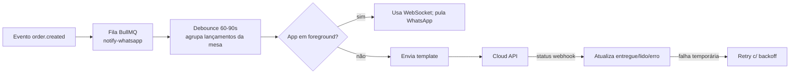

# 10 — Integração com WhatsApp

← [Voltar ao índice](../README.md)

Canal principal de notificação de consumo. Usamos a **WhatsApp Business Platform (Cloud
API)** da Meta — hospedada pela Meta, sem necessidade de manter o WhatsApp Business App.

---

## 10.1 Por que WhatsApp Cloud API

- **Alcance:** praticamente universal no Brasil; o cliente já tem e confia.
- **Sem fricção:** não exige instalar nada para receber o lançamento.
- **Cloud API:** Meta hospeda; recebemos/enviamos via REST + webhooks; escala sem servidor
  de mensageria próprio.

> Alternativa/abstração: usar um **BSP** (Business Solution Provider, ex.: Twilio, 360dialog,
> Gupshup) por cima da Cloud API para faturamento simplificado e ferramentas extras. O
> domínio `notifications` isola o provedor atrás de uma interface (`WhatsAppProvider`).

---

## 10.2 Conceitos-chave da plataforma

| Conceito | O que é | Impacto no design |
|---|---|---|
| **Janela de 24h (service window)** | Após o usuário enviar mensagem, há 24h para responder com mensagens livres | Durante a visita, normalmente estamos na janela |
| **Template (HSM)** | Mensagem pré-aprovada pela Meta, usada para iniciar conversa fora da janela | Boas-vindas e lançamentos usam template |
| **Opt-in** | Consentimento explícito obrigatório para receber mensagens | Coletado no app antes de enviar |
| **Categorias de conversa** | utility / authentication / marketing (afetam preço) | Lançamento = *utility* |
| **Qualidade do número** | Meta monitora bloqueios/denúncias; afeta limites | Conteúdo útil e opt-in reduzem risco |

---

## 10.3 Fluxo de Opt-in e Início de Conversa

```mermaid
sequenceDiagram
    actor U as Cliente
    participant App
    participant API as Backend (notifications)
    participant WA as WhatsApp Cloud API

    U->>App: Ativa "Acompanhar pelo WhatsApp" + consentimento LGPD
    App->>API: POST /sessions/:id/whatsapp-optin {phone_e164}
    API->>WA: POST /messages (template welcome_mesa)
    WA-->>U: 📲 "Olá! Você está na Mesa 07 do Bar do Márcio..."
    U->>WA: responde (ex.: "Ok") → abre janela de 24h
    WA-->>API: webhook inbound (confirma engajamento)
    API->>API: whatsapp_optin=true; pronto p/ enviar lançamentos
```

---

## 10.4 Templates de Mensagem (HSM) — exemplos

> Templates precisam ser **aprovados** pela Meta. Variáveis em `{{n}}`. Categoria *utility*.

### `welcome_mesa` (boas-vindas / abertura de sessão)
```
Olá! 👋 Você está na *Mesa {{1}}* do *{{2}}*.
A partir de agora, cada item lançado na sua conta aparece aqui.
Responda *MENU* para ver opções. Para parar, responda *SAIR*.
```

### `novo_lancamento` (núcleo)
```
🧾 Novo lançamento — Mesa {{1}}

{{2}}

💰 Total acumulado da mesa: {{3}}
🕒 {{4}}

Ver conta completa ▸ {{5}}
```
- `{{2}}` = bloco de itens já formatado ("• 2x Heineken — R$ 24,00\n• 1x Batata — R$ 35,00").
- `{{5}}` = deep link para a conta (abre app/PWA).

### `fechamento_solicitado`, `chamada_confirmada`, `contestacao_resolvida`
Templates utilitários curtos para os demais eventos.

---

## 10.5 Interações Inbound (comandos no WhatsApp)

Mesmo sem abrir o app, o cliente pode interagir por respostas/botões:

| Comando / botão | Ação |
|---|---|
| `CONTA` / "Ver conta" | Responde com total e últimos itens + link |
| `GARÇOM` / "Chamar garçom" | Cria `waiter_call` tipo serviço |
| `FECHAR` / "Fechar conta" | Cria pedido de fechamento |
| `MENU` | Mostra botões interativos (quick replies) |
| `SAIR` | Revoga opt-in (para de receber) |

Usamos **mensagens interativas** (botões/listas) para reduzir digitação. Webhooks inbound
são processados pelo módulo `notifications` e roteados ao domínio correspondente.

---

## 10.6 Arquitetura de Envio (confiável e econômica)



**Otimizações de custo (cada conversa tem custo):**
- **Agrupar** lançamentos próximos em uma mensagem (debounce).
- **Preferir push/WebSocket** quando o app está ativo.
- **Uma conversa utility por janela** quando possível (várias mensagens na mesma janela de
  24h não abrem nova cobrança de conversa, conforme regras vigentes da Meta).
- Monitorar **taxa de entrega/bloqueio** para preservar qualidade do número.

---

## 10.7 Webhooks (inbound + status)

Endpoint `POST /webhooks/whatsapp`:
- **Verificação** (GET) com `verify_token` no setup.
- **Assinatura** validada (`X-Hub-Signature-256`) — segurança.
- Eventos: `messages` (inbound), `statuses` (sent/delivered/read/failed).
- Processamento **assíncrono** (enfileira e responde 200 rápido para a Meta).
- Idempotência por `message id` (evita reprocessar reentregas).

---

## 10.8 Custos e Limites (planejamento)

> ⚠️ Preços e regras da Meta mudam; validar na tabela oficial vigente. Valores abaixo são
> **ilustrativos** para modelagem.

- Cobrança por **conversa** (categoria utility), faixa de centavos de real por conversa.
- **Tiers de volume** (1k, 10k, 100k números/dia) liberados conforme qualidade.
- Estratégia de custo (§10.6) mantém o gasto por mesa baixo (tipicamente **1 conversa
  utility por visita** cobre boas-vindas + vários lançamentos agrupados na janela).
- Repassar/embutir esse custo no modelo de monetização (ver [11](./11-monetizacao.md)).

---

## 10.9 Conformidade e Boas Práticas

- **Opt-in explícito** e registrado (prova de consentimento).
- **Opt-out fácil** (`SAIR`) sempre honrado.
- Conteúdo **utilitário** (a conta que o cliente pediu) — não marketing não solicitado.
- Não enviar fora de contexto da visita.
- Identificação clara do remetente (nome verificado do negócio / do bar).
- Respeitar política de comércio e mensagens da Meta para evitar bloqueio do número.

---

## 10.10 Fallbacks

1. **Push (FCM/APNs)** quando o app está instalado.
2. **PWA/SMS** (futuro) para quem recusa WhatsApp mas quer acompanhar.
3. O **app/PWA** sempre tem a conta em tempo real — WhatsApp é conveniência, não única via.

---

← [Anterior: Segurança e Privacidade](./09-seguranca-privacidade.md) | [Próximo: Monetização →](./11-monetizacao.md)
