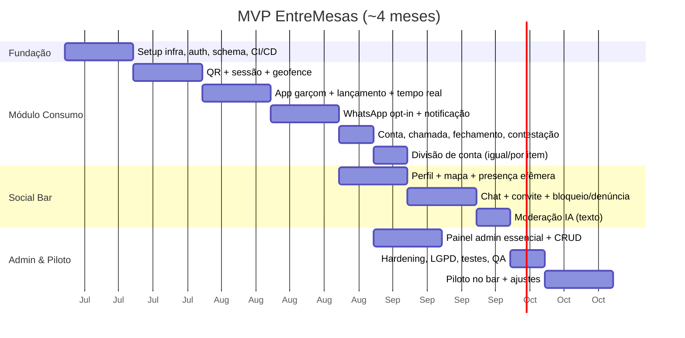

# 12 — MVP Inicial

← [Voltar ao índice](../README.md)

> **Objetivo do MVP:** provar, em **1 bar piloto**, que (a) a transparência de consumo via
> WhatsApp aumenta a confiança e o ticket, e (b) há demanda real pelo Social Bar — com
> segurança e privacidade desde o dia 1.

---

## 12.1 Hipóteses a Validar

| # | Hipótese | Como medir |
|---|---|---|
| H1 | Clientes querem acompanhar a conta em tempo real | % que escaneia QR + ativa WhatsApp |
| H2 | Transparência reduz atrito e aumenta consumo | Δ ticket médio e Δ contestações vs. baseline |
| H3 | Existe apetite pelo Social Bar | % que ativa social + conversas/noite |
| H4 | É operável pelo garçom sem atrapalhar | Tempo de lançamento; feedback da equipe |
| H5 | Dá para manter seguro | nº de denúncias × tempo de ação |

**Critério de sucesso do MVP (go/no-go para Fase 2):**
- ≥ 50% das mesas escaneiam o QR.
- ≥ 60% dos que escaneiam ativam WhatsApp.
- ≥ 20% ativam o Social Bar com ≥ 1 conversa/usuário.
- Δ ticket médio ≥ +8%.
- NPS ≥ 40 e nenhum incidente grave de segurança não tratado.

---

## 12.2 Escopo do MVP

### ✅ DENTRO (must-have)

**Módulo 1 — Consumo (completo, é o core):**
- QR por mesa (token + geofence) e associação à mesa.
- App do garçom: lançar itens (EntreMesas como comanda).
- Conta em tempo real (WebSocket) no app/PWA.
- Opt-in + notificação de lançamento por **WhatsApp** (template).
- Consulta da conta, histórico da visita.
- Chamar garçom e solicitar fechamento.
- Contestação de lançamento.
- Divisão de conta **igual** e **por item** (pagamento no caixa).

**Módulo 2 — Social Bar (versão enxuta, mas real):**
- Perfil efêmero (nick, foto opcional, faixa etária, bio, interesses, status).
- Mapa do bar (mesas, pessoas, status predominante).
- Convite → aceite → **chat interno** (texto).
- Bloquear e denunciar; status 🚫 invisível.
- **Moderação por IA** de texto (mensagens, nick, bio) — mínimo viável de segurança.
- Efemeridade (expira ao sair).

**Painel Admin (essencial):**
- Mesas ocupadas, faturamento ao vivo, consumo por mesa.
- Filas de chamadas e contestações.
- Indicadores sociais básicos (ativos, conversas).
- CRUD de cardápio, mesas (com editor de mapa simples) e equipe.
- Geração/impressão de QR.

**Transversal:**
- Auth (device anônimo + staff), RBAC.
- LGPD: consentimento granular, retenção/efemeridade, portal básico de privacidade.
- Observabilidade mínima (logs, Sentry, métricas-chave).

### ❌ FORA (pós-MVP)

- Pagamento no app (Pix/cartão) — fechamento no caixa no piloto.
- Integração com PDV (EntreMesas é a comanda no piloto).
- Divisão "por valor", rateio avançado de compartilhados.
- Moderação de **imagem** por IA (no MVP: foto opcional desligada ou revisão simples).
- Premium do cliente, mídia patrocinada, multiunidade.
- Push nativo avançado, SMS, PWA offline.
- Matching/sugestões avançadas, gamificação.

---

## 12.3 Stack do MVP (enxuta, mas alinhada ao alvo)

- **Mobile:** Flutter (app cliente + app garçom no mesmo binário, por papel).
- **Backend:** NestJS (monólito modular) + Socket.IO + BullMQ.
- **Dados:** PostgreSQL + PostGIS, Redis.
- **WhatsApp:** Cloud API (sandbox → produção) ou BSP.
- **Admin:** Next.js.
- **Infra:** 1 ambiente gerenciado (ECS/Fargate ou equivalente simples) + RDS + ElastiCache.
- **Moderação:** API de classificação de texto (LLM) com política de moderação.

---

## 12.4 Cronograma (≈ 16 semanas)

- **Equipe sugerida:** 1 tech lead, 2 back-end, 2 mobile (Flutter), 1 front (admin),
  1 designer (UX/UI), 1 PM, apoio jurídico/LGPD pontual.
- **Marco:** ao fim, **piloto rodando em 1 bar real** por ≥ 2 semanas com dados coletados.

---

## 12.5 Plano de Piloto

1. **Bar parceiro** com bom movimento e perfil social (sex/sáb cheios).
2. **Baseline:** 2 semanas de dados do bar (ticket médio, permanência) antes de ligar.
3. **Treinamento** rápido da equipe (app do garçom).
4. **Materiais:** adesivos de QR nas mesas, instrução de uso, banner.
5. **Coleta:** métricas do §12.1 + entrevistas com clientes e equipe.
6. **Suporte presencial** nas primeiras noites (observação de UX real).
7. **Iteração** semanal sobre fricções observadas.

---

## 12.6 Riscos do MVP e mitigação

| Risco | Mitigação |
|---|---|
| "Marketplace frio" no social (poucos ativos) | Escolher bar cheio; incentivo de abertura; foco em densidade por mesa |
| Garçom não adota | App super simples; treinar; medir tempo de lançamento |
| Custo/limite WhatsApp no início | Debounce + push; volume controlado em 1 bar |
| Incidente de segurança no social | Moderação + denúncia + ação manual rápida no piloto |
| Conexão instável no bar | WebSocket com reconexão; PWA resiliente; cache |

---

← [Anterior: Monetização](./11-monetizacao.md) | [Próximo: Roadmap →](./13-roadmap.md)
