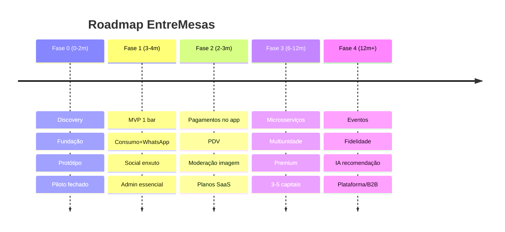

# 13 — Roadmap de Evolução do Produto

← [Voltar ao índice](../README.md)

> Roadmap orientado a **evidência** (cada fase tem critério de avanço) e a **densidade
> geográfica** (dominar uma região por vez para acionar o efeito de rede do Social Bar).

---

## 13.1 Visão em Fases

```
FASE 0          FASE 1            FASE 2              FASE 3             FASE 4
Discovery   →   MVP (1 bar)   →   Produto completo→  Escala (rede)  →   Plataforma
(0–2 meses)     (3–4 meses)       + pagamentos        multi-cidade        (IA, eventos, B2B)
                                  (2–3 meses)         (6–12 meses)        (12 m+)
```

---

## 13.2 Fase 0 — Discovery & Fundação (0–2 meses)

**Objetivo:** validar problema e desenhar a base.
- Pesquisa com donos de bar e frequentadores; validação das personas.
- Definição de métricas, design system, protótipo navegável (Figma).
- Setup de fundação técnica (infra, CI/CD, schema, auth).
- Definições legais: Termos, Política de Privacidade, DPIA do social.
- Fechar **bar piloto**.

**Saída:** protótipo testado + fundação pronta para o MVP.

---

## 13.3 Fase 1 — MVP (3–4 meses)

**Objetivo:** provar valor em 1 bar (escopo em [12 — MVP](./12-mvp.md)).
- Consumo em tempo real + WhatsApp + divisão (caixa) + contestação.
- Social Bar enxuto (perfil, mapa, chat, segurança básica).
- Painel admin essencial.
- Piloto ≥ 2 semanas com coleta de dados.

**Critério de avanço:** metas de sucesso do MVP atingidas (§12.1).

---

## 13.4 Fase 2 — Produto Completo & Pagamentos (2–3 meses)

**Objetivo:** transformar o MVP em produto vendável e fechar o loop financeiro.

**Consumo:**
- **Pagamento no app** (Pix + cartão) na divisão e fechamento.
- Divisão "por valor" e rateio avançado de itens compartilhados.
- **Integração com 1–2 PDVs** populares (Anti-Corruption Layer).
- Histórico entre visitas e "pedir o de sempre".

**Social:**
- **Moderação de imagem** por IA (libera foto com segurança).
- Matching/sugestões por interesses; filtros.
- Quebra-gelos e dinâmicas da casa (enquetes/temas).
- Selo "cliente da casa".

**Negócio:**
- Planos SaaS (Start/Pro/Night) + cobrança recorrente + trial.
- Onboarding self-service do bar.
- Relatórios de vendas e engajamento completos.

**Critério de avanço:** 10–20 bares pagantes em 1 cidade, NRR ≥ 90%, GMV no app fluindo.

---

## 13.5 Fase 3 — Escala (Rede, multi-cidade) (6–12 meses)

**Objetivo:** crescer com eficiência operacional e ativar efeito de rede.

**Plataforma:**
- Extração de microsserviços por gatilho (`notifications`, `social/chat`, `moderation`).
- Multiestabelecimento/franquias; painel de rede.
- Hardening: pentest externo, auditoria, SLOs formais, on-call.
- Promoções patrocinadas (marcas de bebida) — nova receita.

**Crescimento:**
- Densidade por bairro/cidade; playbook de vendas com ROI comprovado.
- **Premium do cliente** (EntreMesas+).
- Programa de indicação (bar indica bar).
- Expansão para 3–5 capitais.

**Critério de avanço:** centenas de bares ativos; CAC com payback < 5 meses; LTV/CAC > 4x.

---

## 13.6 Fase 4 — Plataforma (12+ meses)

**Objetivo:** virar plataforma da experiência noturna.

- **Eventos e festas:** modo evento (festival, balada grande) com mapas dinâmicos.
- **Programa de fidelidade** entre casas parceiras (carteira/pontos).
- **IA de recomendação:** sugestões de consumo e de conexões mais ricas (respeitando privacidade).
- **Inteligência de mercado** B2B anonimizada para a indústria.
- **Reservas e fila de espera** integradas.
- **API pública / parcerias** (apps de delivery, ingressos, mobilidade).
- Expansão nacional e estudo de internacionalização (mercados com WhatsApp forte).

---

## 13.7 Linha do Tempo Consolidada



---

## 13.8 Temas Contínuos (todas as fases)

- **Segurança & Privacidade:** evolução constante da moderação e conformidade.
- **Confiabilidade:** SLOs, observabilidade, custo por mesa sob controle.
- **UX:** pesquisa contínua; reduzir fricção do primeiro scan.
- **Data:** instrumentar tudo; decisões guiadas por métrica (North Star).

---

## 13.9 Principais Riscos Estratégicos

| Risco | Resposta |
|---|---|
| Efeito de rede frio no social | Densidade geográfica; foco em casas cheias |
| Mudança de regras/custo do WhatsApp | Abstração de provedor; canais alternativos (push/PWA) |
| Concorrente de PDV adicionar social | Vantagem de foco em UX social + privacidade + marca |
| Incidente de segurança no social | Investimento contínuo em moderação; resposta a incidente |
| Dependência de gateway/Meta | Multi-fornecedor; contratos; abstrações |

---

← [Anterior: MVP](./12-mvp.md) | [Próximo: Especificação de API →](./14-api-spec.md)
